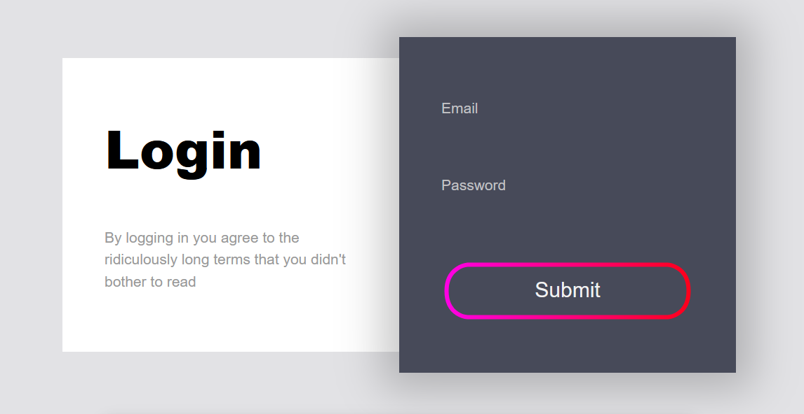

# 🧠 Animated Login Form (Built with ChatGPT)



A **modern animated login form** built using **HTML**, **CSS**, and **JavaScript** — with help from **ChatGPT** and powered by **Anime.js** animations.  
This project demonstrates how AI tools can accelerate front-end development and help developers build beautiful UI components faster.

---

## ✨ Features
- Clean and responsive design  
- Smooth SVG animations using Anime.js  
- Simple validation for email and password fields  
- Toast message notifications for feedback  
- Fully AI-assisted code structure generated through ChatGPT

---

## 🧩 Technologies Used
- **HTML5** – for the page structure  
- **CSS3** – for styling and layout  
- **JavaScript (ES6)** – for interactivity  
- **Anime.js** – for SVG animation  
- **ChatGPT** – to generate and refine the code

---

## 🚀 How to Use
1. Clone this repository:
   ```bash
   git clone https://github.com/EdmondGoddy/AI_Dev_LoginForm_3
   ```
2. Open the project folder:
   ```bash
   cd animated-login-form-chatgpt
   ```
3. Open the file **index.html** in your browser.
4. Start typing your email and password — watch the SVG animation respond!

---

## 🎨 Preview
You can view the live demo on GitHub Pages (if you enable it):  
👉 **[Live Demo](https://raw.githack.com/EdmondGoddy/AI_Dev_LoginForm_3/main/index.html)**

---

## 💡 Learning Outcomes
- How to build responsive login pages  
- How to use Anime.js for creative form animations  
- How ChatGPT can assist in front-end coding and debugging  
- Structuring clean and semantic HTML & CSS code  

---

## 🧠 Created By
**Edmond Goddy**  
🎥 *Part of my YouTube tutorial on AI-assisted web design*  
📺 Watch the video here → [Insert YouTube Video Link]  

---

## 🏷️ Keywords
`ChatGPT`, `HTML`, `CSS`, `JavaScript`, `Anime.js`, `Web Design`, `Frontend Development`, `AI Tools`, `Animated Login Form`, `AICoding`, `Modern UI`, `Web Projects 2025`

---

## 📜 License
This project is open-source under the **MIT License** — feel free to modify and share with credit.
